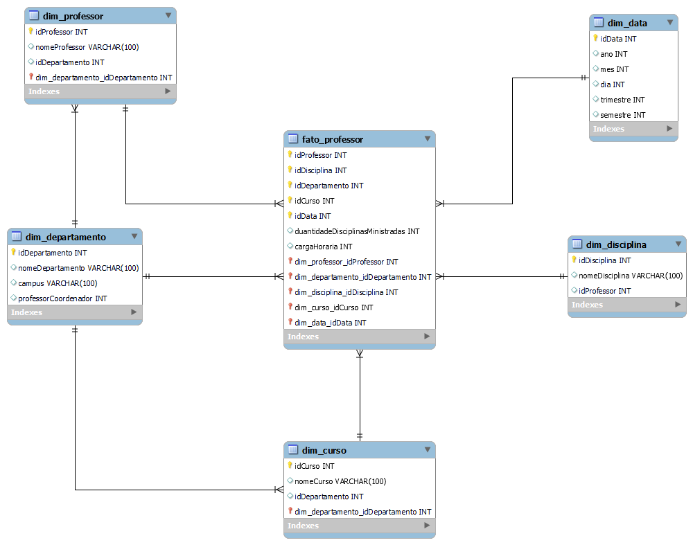

<h1>Dashboard de Vendas com Power BI utilizando Star Schema</h1>

<h3>Repositório criado para o desafio do bootcamp NTT DATA - Engenharia de Dados com Python</h3>

  Este projeto tem por objetivo a criação de um esquema dimensional – star schema – com base no diagrama relacional <a href="https://academiapme-my.sharepoint.com/:w:/g/personal/renato_dio_me/EW6ICs-FWeJPjRJt5mhdTFABzxYtZl87MzYPc6s2N1aO7Q?rtime=qihO-gnn3Eg" target="_blank">disponibilizado</a>.

    Para criar o esquema estrela com foco na análise dos dados de professores, o diagrama dimensional terá uma tabela fato central que engloba informações sobre os professores e sua atuação em departamentos e disciplinas. As tabelas dimensão fornecerão detalhes sobre os professores, cursos, departamentos, disciplinas e datas.

<h3>Esquema Estrela: Fato_Professor e Dimensões</h3>

    

<h4>1. Tabela Fato: Fato_Professor</h4>
    
Esta tabela centraliza as métricas e informações quantitativas para análise. As chaves estrangeiras conectarão as tabelas dimensão.

    <b>Colunas possíveis:</b>
    <ul>
        <li>idProfessor (Chave estrangeira para Dimensão Professor)</li>
        <li>idDepartamento (Chave estrangeira para Dimensão Departamento)</li>
        <li>idDisciplina (Chave estrangeira para Dimensão Disciplina)</li>
        <li>idCurso (Chave estrangeira para Dimensão Curso)</li>
        <li>idData_Oferta (Chave estrangeira para Dimensão Data)</li>
        <li><strong>Métricas:</strong> Quantidade de disciplinas ministradas, carga horária, número de cursos associados.</li>
    </ul>

<h3>2. Tabelas Dimensão</h3>
    

<h4>2.1. Dimensão Professor</h4>
    
Esta tabela contém os detalhes dos professores.

    <b>Colunas possíveis:</b>
    <ul>
        <li>idProfessor (Chave primária)</li>
        <li>Nome</li>
        <li>Departamento_idDepartamento (Relacionamento com Dimensão Departamento)</li>
        <li>Outros atributos relevantes sobre o professor.</li>
    </ul>

    

<h4>2.2. Dimensão Departamento</h4>
    
Contém as informações dos departamentos a que os professores pertencem.

    <b>Colunas possíveis:</b>
    <ul>
        <li>idDepartamento (Chave primária)</li>
        <li>Nome do Departamento</li>
        <li>Campus</li>
        <li>Professor_Coordenador (Relacionamento com a Dimensão Professor)</li>
    </ul>

<h4>2.3. Dimensão Disciplina</h4>
    
Detalhes sobre as disciplinas ministradas pelos professores.

    <b>Colunas possíveis:</b>
    <ul>
        <li>idDisciplina (Chave primária)</li>
        <li>Nome da Disciplina</li>
        <li>Professor_idProfessor (Relacionamento com Dimensão Professor)</li>
    </ul>

<h4>2.4. Dimensão Curso</h4>
    
Esta tabela descreve os cursos oferecidos.

    <b>Colunas possíveis:</b>
    <ul>
        <li>idCurso (Chave primária)</li>
        <li>Nome do Curso</li>
        <li>Departamento_idDepartamento (Relacionamento com Dimensão Departamento)</li>
    </ul>

<h4>2.5. Dimensão Data</h4>
    
Tabela de tempo, essencial para analisar quando os cursos e disciplinas foram ofertados.

    <h4>Colunas possíveis:</h4>
    <ul>
        <li>idData (Chave primária)</li>
        <li>Ano</li>
        <li>Mês</li>
        <li>Dia</li>
        <li>Trimestre</li>
        <li>Semestre</li>
        <li>Outros atributos como dias úteis ou finais de semana.</li>
    </ul>

<h3>3. Relacionamentos no Esquema Estrela</h3>
    

A tabela <strong>Fato_Professor</strong> se conecta a cada uma das dimensões por meio das chaves estrangeiras.

    
A granularidade pode variar dependendo dos dados oferecidos, mas cada linha da tabela fato representa uma oferta de disciplina por um professor em um curso específico e em um determinado momento.

    
A estrutura final resultante será uma tabela fato central que engloba os dados quantitativos relacionados aos professores, conectada a várias tabelas dimensão que detalham as diferentes entidades envolvidas no contexto de ensino (departamentos, disciplinas, cursos, etc.).

<h3>4. Cardinalidade dos relacionamentos:</h3>

<table>
        <thead>
            <tr>
                <th>Tabela Fato</th>
                <th>Tabela Dimensão</th>
                <th>Relacionamento</th>
            </tr>
        </thead>
        <tbody>
            <tr>
                <td>fato_professor</td>
                <td>dim_professor</td>
                <td>N:1</td>
            </tr>
            <tr>
                <td>fato_professor</td>
                <td>dim_departamento</td>
                <td>N:1</td>
            </tr>
            <tr>
                <td>fato_professor</td>
                <td>dim_disciplina</td>
                <td>N:1</td>
            </tr>
            <tr>
                <td>fato_professor</td>
                <td>dim_curso</td>
                <td>N:1</td>
            </tr>
            <tr>
                <td>fato_professor</td>
                <td>dim_data</td>
                <td>N:1</td>
            </tr>
            <tr>
                <td>dim_professor</td>
                <td>dim_departamento</td>
                <td>N:1</td>
            </tr>
            <tr>
                <td>dim_curso</td>
                <td>dim_departamento</td>
                <td>N:1</td>
            </tr>
        </tbody>
    </table>

<h4>Explicação das Cardinalidades:</h4>
<ul><li>Muitos para 1 (N:1): Isso significa que várias ocorrências de uma tabela podem estar associadas a uma única ocorrência de outra tabela. Por exemplo, muitos registros de fato_professor podem estar relacionados a um único professor na tabela dim_professor.</li></ul>

